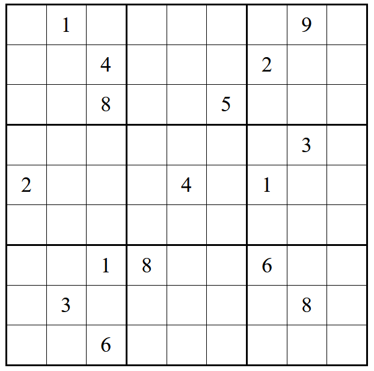
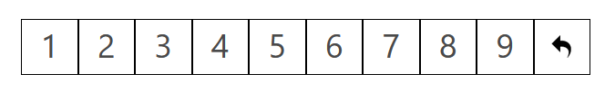
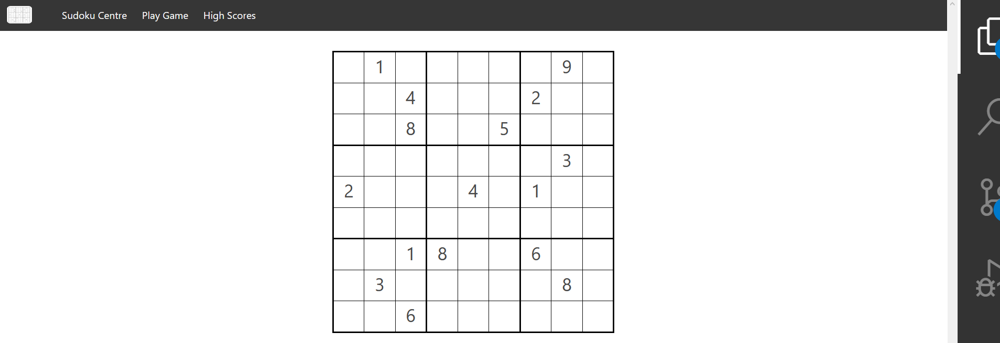
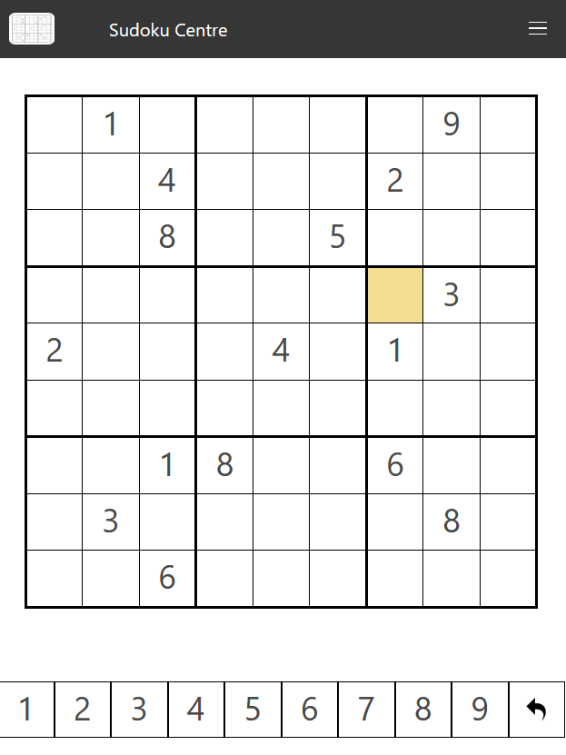
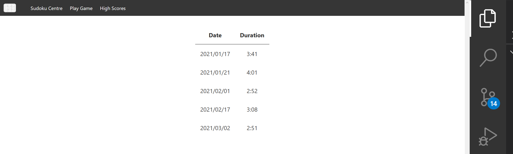
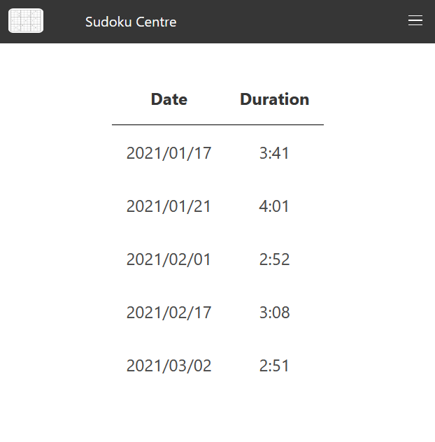

# Lab 01-03

The starter code for lab 01-03.


## Overview

Let's create the skeleton of a web-based sudoku game, implemented as two web pages, a game page and a high scores page.

_**Note:** This lab is designed to take 3 weeks, and is divided into three parts.  Each of the three parts is worth the weight of one lab assignment (3% each).  It is recommended that you do the content and layout in the first week, the design of the overall page and interaction system in the second week, and finally the interaction system code in the third week._


## Part 1 - The Basic User Interface


### Board Design

The primary feature of the main web page is the sudoku board.  This will be implemented as a 9x9 table, with appropriate styling (see the figures, below).  The board must be centred horizontally on the page, and each column and row must be consistent sizing.  For the purposes of this part of the lab, hard code the values shown in the sample below.  The table will be given the id `board` for easy styling and element lookups in JavaScript, later.  Try to match the font and font size as closely as possible, and use the various screenshots throughout this document to match the layout, table borders, and other styling.



_Figure 1 - The sudoku board_

Below the game board, there will be another table consisting of every digit, except zero (`1`-`9`), as well as an undo icon (`images/undo.png`).



_Figure 2 - The numbers palette_

_**Note**:  All styling information should be included in the provided CSS file (`sudoku.css`)._


### Additional Styling

When the cursor hovers over a cell in the Sudoku board, or in the numbers palette, it should change its background colour to `#f5dd90`.  Create two additional CSS classes, which will be used in the next part:
- `user-input` - will set the background colour to `#f2f2f2`
- `error` - will set the background colour to `#f76c5e`


## Part 2 - Common Page Elements and a High Scores Table


### Common Page Elements

Both the game page and the high scores page will have the same header, which will show a logo and the title of the page, as well as a simple menu.  This will be made using the Bulma CSS framework.  For simplicity, you can just copy/paste the code into the other page once you get it working in one of the pages.

The menu will appear horizontally in a large display, and will collapse into a menu button on smaller displays.  The menu will have two items:
- `Play Game` - links to the game page (`sudoku.html`)
- `High Scores` - links to the high scores page (`high_scores.html`)



_Figure 3 - The game page - desktop version_



_Figure 4 - The game page - mobile version_

_**Note**:  All styling information should be included in the provided CSS file (`sudoku.css`)._


### High Scores Table
The high scores page will display a list of high scores, including the date (format: `YYYY/MM/DD`) and the duration (in minutes and seconds, format: `mm:ss`) to complete.  For now, just fill this table with sample data from the figures, below.



_Figure 5 - The high scores page - desktop version_



_Figure 6 - The high scores page - desktop version_


## Part 3 - Dynamic Content


### Sudoku Page

Add code to the `sudoku.js` file that will dynamically build the game board, based on an array of integers (`1`-`9`, with `-1` being a special placeholder value representing empty cells).  When you create the `<td>` elements, give them a name (e.g. `cell21` for the cell in row 2, the third row, and column 1, the second column), so that it will be easy to lookup.

When a cell in the numbers palette is clicked, it will make that digit active.  When a digit (`1`-`9`) is active, clicking on a cell in the game board will make the number appear in that game board.  This is how a user will make a move in the game.  When a move is made such that one of the following condition holds, all conflicting cells will be highlighted usign the `error` CSS class:

- another of the same digit is present elsewhere in the same row
- another of the same digit is present elsewhere in the same column
- another of the same digit is present elsewhere in the same 3x3 block

The following code may be helpful (if you choose to use it):

```
function sameBlock(x1, y1, x2, y2) {
   let firstRow = Math.floor(y1 / 3) * 3;
   let firstCol = Math.floor(x1 / 3) * 3;
   return (y2 >= firstRow && y2 <= (firstRow + 2) && x2 >= firstCol && x2 <= (firstCol + 2));
}

function sameRow(x1, y1, x2, y2) {
   return y1 == y2;
}

function sameColumn(x1, y1, x2, y2) {
   return x1 == x2;
}
```

_**Note**: Be sure to handle the case where the `x` and `y` values are identical.  That would not be a conflict._

Finally, the undo button will undo the last move made by the user.  This will include un-highlighting any previously highlighted cells from an erroneous move.


### High Scores Page

Add code to the `high_scores.js` file that will dynamically build the high scores table, based on an array of JavaScript objects (e.g. `{"date": "2021/03/02", "duration": "2:51"}`).


## Need Extra Challenge?

If this was too easy, and you want some additional practice, try out one or more of the following extra features for increased learning:

1. Make the undo feature store all moves made since the beginning of the game.
2. When a cell is highlighted (when the mouse is over a cell), highlight the row, column, and block containing that cell.
3. Write the complete game functionality, which checks if every space has a digit in a non-conflicting position.  If so, record the duration of the game in the high scores table.
4. Add the ability to reset the game back to its starting position.
5. Add randomized board generation for when the game is restarted.


## Getting Help

If you run into difficulty, you may wish to check out some of the following resources:

- https://developer.mozilla.org/en-US/docs/Learn/HTML - Tutorials and reference documentation for HTML by the Mozilla Developer Network (MDN)
- https://developer.mozilla.org/en-US/docs/Learn/CSS - Tutorials and reference documentation for CSS by the Mozilla Developer Network (MDN)
- https://developer.mozilla.org/en-US/docs/Web/JavaScript - Tutorials and reference documentation for JavaScript by the Mozilla Developer Network (MDN)
- https://www.w3schools.com/ - Tutorials for HTML, CSS, and JavaScript by the W3Schools group
- http://stackoverflow.com/ - A forum for asking questions about programming.  I bet you know this one already!

Of course, you can always ask the TA for help!  However, learning how to find the answers out for yourself is not only more satisfying, but results in greater learning as well.


## How to Submit

Create your code inside this folder, commit, and then push your code to this repository to submit your lab assignment.